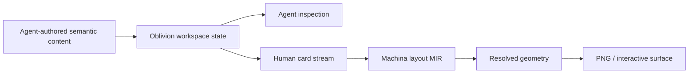

# One semantic state, several projections

The durable truth is the semantic content plus Mermaid source. A rendered SVG
or PNG should be a derived artifact with provenance, not a replacement for the
editable diagram source.

The current Markdown renderer preserves the source and readable fallback, but
does not render Mermaid inline. That is useful evidence: diagrams need a
generic semantic contract with a Mermaid source format and an external-renderer
path before Machina needs its own graph engine.
