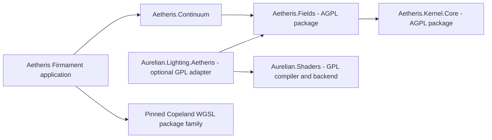

# Aetheris field lighting: first milestone

The optional `Aurelian.Lighting.Aetheris` adapter runs Aetheris's admitted analytic
3D fields in the existing Vulkan pixel pipeline. It provides hard direct-light
visibility, an experimental distance-ratio penumbra, and the existing raster
shadow fallback for unresolved rays. Default game shaders/settings are unchanged.

This is the direct-visibility foundation for the proposed Lumen-inspired system.
It does not implement diffuse GI, reflections, clipmaps, radiance caches or
temporal reconstruction. Vulkan executes the field shader on the GPU; it does
not use ray-tracing hardware for these analytic sphere-tracing steps.

## Owners and dependencies



The adapter uses packages, with no sibling Aetheris `ProjectReference` and no
Firmament/Continuum dependency. Fields depends only on Core; it owns the existing
primitive/Boolean expressions, evaluation tape, capability analysis and VTS
lowerer. Continuum references Fields and forwards the moved public types; their
existing namespace is retained for compatibility.

The seven pinned Copeland dependencies observed in Aetheris are restored NuGet
packages for Firmament's display compiler, not seven cloned source projects:
Markdown, Profile, SpanAllocation, TS, TS.Mir, TS.Workspace and TS.Backend.Wgsl.
The current pin is `0.1.0-preview.1-a3.16c0ce996358af80`. Building only Fields/Core
does not restore this family. Building full Aetheris still does.

Existing `Aurelian.Humanoid` and `Aurelian.AetherisBake` source bridges remain
explicit sibling-repository development dependencies. This milestone does not
claim that the entire Aurelian solution is now standalone.

## Licence boundary

The new adapter and authored tracing shaders are GPL-3.0-only. Aetheris remains
AGPL-3.0-only. Existing components retain their grants, including Copeland
packages whose metadata specifies GPL-3.0-or-later. No repository is relicensed.

[GPLv3 section 13](https://www.gnu.org/licenses/gpl-3.0.html#section13) and
[AGPLv3 section 13](https://www.gnu.org/licenses/agpl-3.0.html#section13) allow
combination while retaining each part's licence. Combined distribution must
preserve notices and provide the applicable Corresponding Source. Where AGPL's
network-source clause applies, the source offer includes incorporated GPL code.

Generated analytic field shader implementation is conservatively treated as
AGPL-derived code: retain source, structural identity, originating scene and
notices. Baking a shader does not remove that boundary. Geometry/artist assets
retain their own terms; exporting them does not automatically license them AGPL.

Both licence texts are included by the adapter and copied into proof output.
`NOTICE.md` records the component distinction. A distributable source bundle must
also include the precise source of the dependencies and any local modifications;
an upstream revision alone cannot describe an uncommitted working tree.

## Build and use

Until the new package is published, produce the two packages from Aetheris:

```powershell
dotnet pack ../Aetheris/Aetheris.Kernel.Core -c Release -m:1 --output ../Aetheris/artifacts/local/fields/packages
dotnet pack ../Aetheris/Aetheris.Fields -c Release -m:1 --output ../Aetheris/artifacts/local/fields/packages
dotnet build Aurelian.slnx -c Release -m:1 -p:AetherisPackageFeed=C:/Users/yuech/source/repos/Aetheris/artifacts/local/fields/packages
dotnet run --project tools/Aurelian.GraphicsProof -c Release --no-build -- --field-lighting --output artifacts/local/aetheris-field-lighting
```

The feed property is explicit, optional and replaceable with a published NuGet
feed. It is not a hidden source-checkout discovery mechanism. The native proof
uses packages and embedded licence texts at runtime.

```csharp
SdfNode geometry = new SdfSubtractNode(
    new SdfBoxNode(3000, 350, 3000),
    new SdfBoxNode(2400, 500, 2400));
AetherisLightField field = AetherisLightField.Create(geometry);
IReadOnlyList<GpuSourceFile> sources = field.Sources("FieldSolid3D.v.ts", LoadRuntimeShader);
// Compile with GpuGraphicsBinder and VdMirGraphicsBackend, then pass the exported
// program to VulkanSolid3DRenderer's existing constructor.
```

The consuming game supplies the shared `Lighting3D.v.ts` source through its
normal asset loader. Field specialization never patches generated HLSL.

## Qualification and current limits

The source convention is mm/Z-up, converted to game metres/Y-up by
`(x, y, z) -> (1000x, -1000z, 1000y)`. Only rigid admitted analytic fields enter
this path. Boolean occupancy is not advertised as exact Euclidean distance;
its admitted exterior bound is sufficient for bounded stepping.

The adapter caps source trees at 128 nodes and depth 16. The shader traces at most
256 steps along a normalized, at-most-48m ray, within
64m query coordinates. It uses a 0.5mm hit tolerance, 4mm surface offset and a
0.05mm numerical margin. These are bounded experiment settings, not a proof for
every f32 grazing ray or arbitrarily thin feature. Exhaustion remains unresolved
and uses raster visibility. Non-rigid, out-of-range and unsupported fields fail
before compilation rather than quietly becoming mesh approximations.

Geometry changes invalidate the structural source identity and recompile a
pipeline; changing the sun uses the existing uniform. This first version is
suited to static geometry, not per-frame skinned field reconstruction. Other
opaque occluders must be represented in the field or use another explicit
backend; raster fallback handles unresolved field rays, not missing occluders.
The supplied material is the untextured Solid3D contract; existing textured and
skinned materials continue to use their raster shaders. They can consume the
shared tracer in a later material integration pass.

The native witness uses Aetheris BRep tessellation for display, a CSG opening,
sphere and thin bars. Four receiver/sun/object cases compare GPU classifications
against independent Aetheris BRep analytic ray queries. A scalar compute probe
also compares 5,000 field evaluations across the fixture, cylinder, cone, torus
and rotated box to the double-precision tape. Repeated
pixels must agree, budget starvation must expose unresolved rays, and the
starved lighting shader must reproduce raster fallback. The existing depth pass
and allocations are retained; reported timings are not claimed VRAM savings.

Local generated images, SPIR-V/HLSL, logs and test results stay under ignored
`artifacts/local/aetheris-field-lighting`. `field-evidence.json` is the measured
result; `comparison.png` shows raster, hard field and experimental soft lighting.

## Measured closeout, 2026-10-09

Success for this bounded direct-visibility milestone on NVIDIA GeForce RTX 3070:

| Witness | Result |
| --- | --- |
| Four GPU/BRep ray comparisons | 262,144 rays; nine classification differences; zero unresolved |
| Five CPU/GPU field comparisons | 5,000 samples; maximum absolute error below 0.000001m |
| Repeated scene | Identical pixels |
| Receiver-only floor | Zero self-shadow pixels |
| One-step budget negative specimen | 65,530 unresolved rays, explicitly exposed |
| One-step lighting fallback | Two pixels differ from existing raster rendering |
| Isolated field package restore/run | Only Fields and Core restored; native evaluator/lowerer passed |
| Aurelian full solution tests | 985 passed, zero failed/skipped |
| Copeland TS compiler tests | 1,469 passed, zero failed/skipped |
| Aetheris fast Core lane | 1,058 passed, zero failed/skipped |
| Aetheris full solution tests | 4,415 passed, zero failed/skipped |

The Aurelian suite used the already-installed Naga executable through
`AURELIAN_NAGA=artifacts/aurelian-beacon3d/toolchain/bin/naga.exe` resolved to an
absolute path. Aetheris's full solution also reports no discovered tests in
FrictionLab; the totals above are executed tests. The initial fixed TRX filename
was overwritten between Aetheris projects, so its full stdout log is the retained
per-project count evidence. The generated STEP fixture rewritten by that suite
was restored to its original tracked version after validation.

At 640x640, the fixture's field lighting pass was roughly 1.3–1.5ms versus
roughly 0.1–0.2ms for raster lighting in the warmed native runs. This establishes
correct GPU execution and useful analytic detail, not a performance win over
raster shadows. Acceleration/caching remains future work. Raw timings and exact
binary/source hashes are in the local evidence JSON. No tool downloads were
needed for this milestone.
