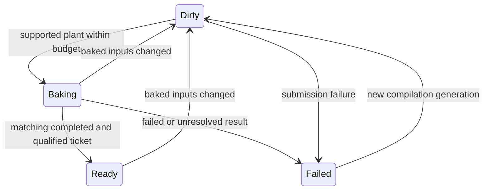

# Lighting compilation foundations

The follow-up [scene lighting expert experiment](scene-lighting-experts.md)
combines native OpenUSD artifacts, Cycles reference integration and deterministic
Vulkan decoders with measured Dominatus selection.

This milestone treats a lighting artifact as the compilation of an explicitly
declared scene domain. It qualifies retained GPU work, typed dependency identities,
Dominatus policy and bounded experiments. It does not enable GI/reflections in
every game material or claim a production lighting system.

## Ownership and authoring

- `Aurelian.Rendering.Contracts.Lighting` owns dependency identities, finite
  quality settings, plant-neutral requests/completions and linear response coefficients.
- `Aurelian.Runtime.Lighting` owns the Dominatus policy agents and scheduling.
  It has no graphics-backend dependency and stores no native resources.
- `Aurelian.Graphics` owns submission, images, barriers, readback qualification,
  sampling and safe resource retirement.
- The optional `Aurelian.Lighting.Aetheris` adapter owns static surface materials
  and the admitted field bake recipe. Aetheris continues to own geometry/evaluation.

Each body has an authored identity, analytic geometry, Lambertian albedo and
emission. Materials are not guessed from display colours. One material owns each
body, including its Boolean cuts. At a union hit the closest body boundary owns
the material; exact ties use declaration order. This is a bounded static opaque
surface contract, not a general textured/skinned material evaluator.

```csharp
var scene = new AetherisLightingScene([
    new("wall", wallGeometry, new(.8f, .04f, .025f), Vector3.Zero),
    new("lamp", lampGeometry, new(.8f), new(8, 5, 2)),
]);
var recipe = new AetherisLightingBakeRecipe(
    scene,
    LightingArtifactKind.DiffuseTransfer,
    new LightingReceiverPlane(new(-2.7f), new(5.4f)),
    lightDirection: sunDirection);

CompiledGraphicsProgram shader = recipe.Compile(LoadRuntimeShaderSource);
float[] uniforms = recipe.UniformValues();
LightingCompilation plan = recipe.Compilation(
    "room.diffuse", shader, VulkanLightingBake.ParameterIdentity(uniforms));
// The host's controller submission delegate creates this owner and returns its ticket.
var batch = new VulkanLightingBake(plant, plan, shader, uniforms);
LightingBakeTicket ticket = batch.Submit(generation: 1);
// Later host ticks poll IsComplete(). ReadLinear() qualifies the resolution mask.
// Only then report completion to the controller and expose its published output.
```

The adapter has no graphics-backend reference. The host computes the identity of
the actual uniform bytes; the native bake verifies it before allocating work.
The shader identity includes canonical VD-MIR, entry points, profiles and actual
SPIR-V bytes. Changing backend output cannot silently reuse an old artifact.

## Contract and invalidation

`LightingCompilation` requires content identities for geometry, materials, light
layout, receiver domain and executable shader. Extent, sampling, trace budget,
artifact kind and linear-response declaration participate in the content key.
Consumer slot names do not. The key is deterministic for identical inputs.

The field recipe currently admits horizontal +Y receivers within a bounded 16m
domain. Visibility uses one ray per texel. Diffuse transfer uses sixteen fixed
cosine-weighted hemisphere directions and a unit-albedo receiver. Reflection
radiance uses one sharp reflected ray for an explicit eye. Receiver albedo or
specular weighting is applied by a consuming material; these are separate data
layers, not finished beauty renders. Secondary hits include authored emission
and shadowed Lambertian direct lighting. There is one bounce, no recursive solve.

View-independent recipes canonicalize unused eye values; moving the camera does
not invalidate their keys. Reflection eye changes invalidate the reflection
domain. Geometry/material changes invalidate the appropriate compiled response.
All uploaded values are keyed. Unsupported BRDF-table recipes fail explicitly;
the neutral artifact kind reserves a contract, not an implemented BRDF compiler.

Diffuse/reflection linear-response declarations permit scaling the entire fixed
lighting configuration together. This experiment combines unit-white sunlight
and fixed authored emission. Independent light colours/intensities would require
separate response artifacts; arbitrary edits cannot be applied to this one map.
Runtime scaling operates in scene-linear space before tone mapping.

## Controller and plant protocol

Each artifact slot is a real Dominatus HFSM agent:



The host supplies availability/capability facts, ray and estimated-time budgets,
and completion observations on its owning tick thread. Ray estimates include
secondary direct-light visibility for diffuse/reflection work. Initial cost
hints are replaced by measured cost per plant and artifact kind after successful
completion. Selection uses estimated cost, then plant ID; jobs run in registration
order. At most one new batch is delegated to each plant per controller tick.
Budgets estimate admission cost; they are not GPU preemption or a deadline guarantee.

Changed inputs immediately withdraw `Published`. The HFSM reaches `Dirty` on
its next tick and dispatches on a subsequent tick. `Phase` reports the actual
policy state; consumers must use the current published ticket, not a phase name
alone. Completion must match plant ID, completion domain, fence value, content
key and generation. Independently owned timelines may have identical counters;
they do not share completion authority. Superseded completions are ignored.

`controller.Inspector.Observe()` exposes kernel states, reasons, input generations,
delegation costs, blackboard changes and transition traces. Native resources stay
outside kernel checkpoints. This milestone does not implement controller restore
or exact graphics rewind. A future restore must reconstruct logical requests and
recompile or revalidate outputs rather than restore native handles.

For feedforward use, the host can submit an explicitly authored future variant
in a separate slot before it is needed. Activation must still check its content
key against the actual scene. Predictive camera scheduling, activation policy,
deadlines and cancellation remain future work. Multi-plant policy selection is
unit-tested with neutral facts; actual multi-GPU execution is unqualified.

## Native execution and qualification

`VulkanLightingBake.Submit` calls the existing command submitter with
`WaitForCompletion: false`. A whole finite image is one batch. Polling uses the
existing timeline fence. Colour writes transition explicitly to fragment-sampled
layout. Submitted uniform/image resources are immutable and retained until
completion; image replacement uses a different owner.

The RGBA16F result stores linear response in RGB and an explicit resolution mask
in alpha. This first path reads that mask once per completed bake and rejects
nonfinite, negative or unresolved outputs. Completion alone does not authorize
sampling. `CreateView` requires qualification. Retained views only sample the
texture; disposing an owner while views remain is rejected. Views submit and wait
through the existing output pass, so frame presentation is still synchronous.

The bake uses the graphics queue. Nonblocking CPU submission is established;
simultaneous compute/graphics execution, device groups and cross-device transfers
are not. Whole batches are not tiled shadow maps, surface atlases or probe volumes.
This narrow experiment chose an explicit receiver map to test shadow, diffuse
and reflection compilation with one shared storage/publication path.

```powershell
dotnet build Aurelian.slnx -c Release -m:1
dotnet run --project tools/Aurelian.GraphicsProof -c Release --no-build -- --lighting-compilation
```

Output is ignored local evidence under `artifacts/local/lighting-compilation`:
`compilation-evidence.json`, `controller-inspection.json`, retained source/HLSL,
licence notices and `comparison.png`. The contact sheet shows the directly lit
room, visibility maps and response layers. GI and reflections are not composed
into the room's default material in this milestone.

On the local RTX 3070 witness:

- All 16,384 cached shadow classifications agree with independent BRep rays.
- Sixty unchanged controller ticks produce zero additional bake submissions.
- Runtime response scaling reuses the existing GPU map; repeated samples agree.
- Emission removal, occluder movement and reflection-eye changes rebuild and
  materially change their outputs.
- A deliberately one-step trace fails qualification and cannot be sampled.
- All 117 sampled reflection responses agree with BRep hit/material/direct-light
  calculations within 0.02 scene-linear units.
- All 117 sampled diffuse responses agree within 0.01 scene-linear units using
  the recipe's 0.1 mm primary radiance-hit tolerance.
- The coarse 0.5 mm radiance experiment fails at `(row 41, column 125)`. A ray
  passes 0.48 mm from the lamp and incorrectly picks up its emission. This
  negative specimen remains in the evidence; tightening primary radiance hits
  resolves it within the same trace budget. Shadow visibility retains 0.5 mm.

Sixteen fixed diffuse directions also cause visible spatial banding. This proves
transport and caching, not acceptable production GI quality. More samples or
visibility-aware reconstruction are needed for the spatial quadrature artifacts.
Sharp reflection data is tied to one eye; an unrestricted moving camera cannot
reuse it as a universal reflection map.

GPU timestamp evidence compares a one-time 128x128 bake with a 512x512 retained
lookup/tone-map pass. It demonstrates amortization for this static domain, not
equal-resolution image quality or a general renderer speedup. CPU pipeline
creation, source compilation, readback and transfer costs are excluded from those
GPU times. Exact timings live in the evidence JSON.

The optional Aetheris package/licence boundary remains as documented in
[field lighting](aetheris-field-lighting.md). No sibling repositories are changed.

## Validation

The local qualification ran `dotnet build Aurelian.slnx -c Release -m:1
--no-restore` successfully, with zero warnings/errors in the final incremental
build. The full Aurelian solution test run passed 995 tests across 28 test
projects, with zero failures/skips. The Copeland TypeScript compiler suite also
passed all 1,469 tests with zero failures/skips.

Both native commands passed on the RTX 3070: `--lighting-compilation` and the
existing `--field-lighting` regression witness. These are native offscreen Vulkan
execution proofs, not a desktop game integration or multi-GPU qualification.
