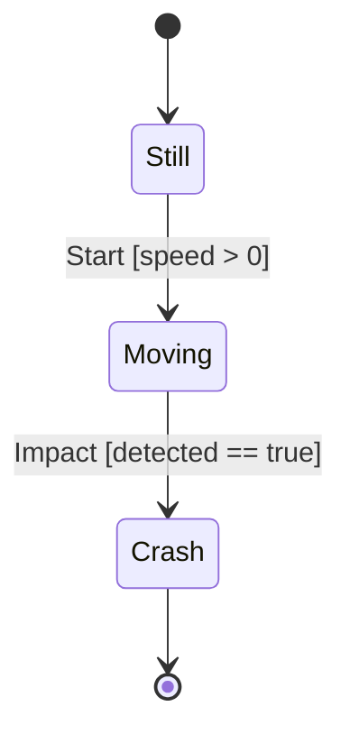

# Mermaid state-diagram backend — VIZ-M2

`DiagramBackendKind.State` selects a `stateDiagram-v2` lowering while keeping
Mermaid syntax out of Diagram IR. State diagrams reuse `DiagramNode` and
`DiagramEdge`; the only backend-neutral additions are the backend kind, one
initial node identity, final node identities, and optional edge semantic
identity/order.

## Lowering

The emitter assigns `s0`, `s1`, ... after nodes are normalized by semantic ID:

Initial and final pseudo-states are backend syntax, not fake Diagram nodes.
Self transitions and every parallel transition remain separate edges.

## Ordering and determinism

State nodes normalize by semantic identity so backend aliases are stable.
Transition edges preserve the semantic projection's source order; semantic
transition identity is the deterministic tie-breaker. Final identities
normalize ordinally. The emitter uses LF, no timestamp, no random ID, and no
filesystem-dependent content. Repeated compilation and materialization are
byte-identical.

## Labels and escaping

State names are quoted declarations. Quotes, ampersands, angle brackets, and
newlines in those quoted names use Mermaid-compatible HTML escaping. Unicode is
preserved. Transition text is the remainder of a Mermaid state-transition line,
so brackets, colons, braces, quotes, and comparison operators remain literal;
CR/LF is deterministically flattened to ` / `. This policy was qualified with
Mermaid CLI 11.16.0. Numeric bracket entities are deliberately not used because
the state parser renders them visibly instead of decoding them like the
flowchart backend.

The semantic projection, not the backend, constructs `Event [guard]`. The
backend only owns syntax-safe emission.

## Validation and limits

`Diagram.TryCreate` rejects duplicate/empty IDs, unknown edge endpoints, and
unknown initial/final references. The state projection enforces 256 states,
1,024 transitions, bounded guard displays, and 1 MiB emitted Mermaid. Oversize
graphs fail explicitly; state or transition collections are never truncated.

The maintained `.mmd` artifacts are rendered through the repository's pinned
`@mermaid-js/mermaid-cli@11.16.0` installation. VIZ-M2 adds no renderer,
layout engine, SVG backend, or pixel-golden test.

Mermaid chooses layout and may place labels close together for dense parallel
edges. That presentation limitation does not merge or lose semantic edges; the
inspectable Mermaid remains authoritative and every transition is present.
