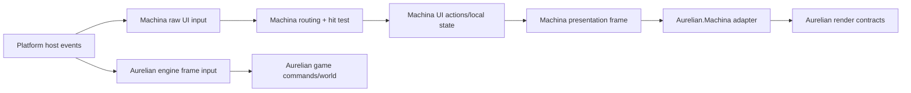

# Joint Task Force target semantic boundaries

This document is the authoritative target semantic architecture for the Joint Task Force monorepo after the JTF migration ladder completes. The JTF-M0 doctrine remains authoritative for current physical topology and enforcement until each migration lands. Historical milestone records are evidence, not current ownership doctrine.

## Governing rule

> The producer owns its semantic output. The consumer owns the adapter that consumes it.

Dependency direction follows meaning rather than implementation convenience. Integration behavior is visible in explicitly named integration projects.

## Stable subsystem ownership

### Copeland

Copeland owns reusable compiler conventions and primitives, source text/provenance, diagnostics, frontend/parsing/lowering support, compiler-internal MIR infrastructure, artifact infrastructure, explicit compiler lanes, and compiler CLI surfaces. A concept is promoted into Copeland only after at least two concrete compiler lanes need the same semantics-free abstraction and extraction does not import shader, Vulkan, engine, UI, or runtime policy.

Copeland does not own SDSL-V meaning, shader stages/resources/bindings, VD-MIR merely because it is an IR, HLSL/DXC/SPIR-V policy, renderer contracts, UI, game runtime, or Dominatus orchestration.

### Machina.UI

Machina.UI owns UI authoring/documents, elements and standard components, layout, text shaping and layout, typography/font selection and metrics, screen/presenter composition, semantic layers, UI hit testing, raw-UI-event normalization, UI input routing, interpreted UI actions, simple local UI state, and backend-neutral presentation intent.

Its narrow renderer-facing output is a **Machina presentation frame**: immutable viewport metadata plus an ordered, clip-aware list/tree of UI presentation operations sufficient for current behavior—filled rectangle, stroked rectangle, positioned text runs, push clip, and pop clip—with Machina color/text style, stable element identity, and already-resolved geometry. It contains no Dominatus types, raster surface/pixels, Aurelian contracts, Vulkan handles, game objects, or universal rendering IR concepts. Hit-test data remains a sibling UI runtime result, not renderer input.

Machina owns this vocabulary because it describes what the UI producer requests. A renderer may translate it into its own command vocabulary; the two vocabularies must not be collapsed.

### JTF-M2 implementation status

JTF-M2 establishes this boundary in `Machina.Presentation`. `MachinaPresentationFrameBuilder` is the canonical lowering traversal, and `MachinaRasterPipeline` exposes the resulting frame beside its hit-test artifact. The retained Dominatus/raster route is reached only through the temporary `LegacyMachinaRenderCommandAdapter`; it is scheduled for retirement in JTF-M5. The frame contract is intentionally limited to a viewport and ordered fill rectangle, stroke rectangle, positioned text, push rectangular clip, and pop clip operations. Its assembly references only Machina Core, Layout, and Standard projects.

### Aurelian

Aurelian owns engine lifecycle, worlds/game objects, engine actuation, frame loop, engine frame input, game-domain commands, renderer-neutral engine snapshots and command plans, compositor policy, presentation mechanism contracts, renderer backends (null, CPU raster, Vulkan), assets, shader-domain compilation and artifacts, and Dominatus engine/runtime integration.

`Aurelian.Core` is backend-neutral. It retains engine lifecycle/frame coordination, compositor-policy ports, presentation-mechanism ports, and engine-owned screen/world seams. Concrete Vulkan compositor/presentation adapters and their diagnostics live with `Aurelian.Graphics` (or a narrowly named Aurelian Vulkan backend project if later split). Core never references that concrete backend.

### Integrations

`Aurelian.Machina` is consumer-owned and depends on Machina.UI presentation contracts and Aurelian renderer contracts. It translates Machina presentation frames into Aurelian render inputs and connects Machina UI actions/input routing to Aurelian runtime/game behavior. It does not own either side's semantic contracts.

An Aurelian host/backend integration owns platform window creation, event pumping, conversion of platform events into neutral raw UI input and/or engine frame input, swapchain presentation, and lifecycle wiring. If Vulkan-specific core adapters cannot remain inside `Aurelian.Graphics` without creating an undesirable dependency surface, use an explicitly named `Aurelian.Graphics.Vulkan` project; this is an Aurelian backend split, not a cross-subsystem bridge.

## Presentation and input flow

Raw platform events belong to the platform host/backend. Neutral UI input, hit testing, routing, and UI actions belong to Machina. Engine frame input and game commands belong to Aurelian. Translation between UI actions and game behavior belongs to `Aurelian.Machina` or the consuming game, never Machina core.

General stack mechanics (`PresenterScreenStack`, layer keys/order, visibility and deterministic composition) are Machina presenter concepts. Generic layer names such as background, HUD, overlay, modal, debug, and cursor follow them. Aurelian owns world-screen semantics and supplies an adapter/content participant for the world layer. Platform present callbacks are not screen semantics.

## Text boundary

Machina owns text content semantics, rich-text runs, font selection, typography, shaping, line breaking, measurement, alignment, and positioned glyph/run intent. Renderer backends own glyph rasterization, atlas/texture upload, sampling, blending, clipping at pixel/device precision, and final pixels. Backend-independent font assets and metrics may remain Machina-owned; backend-specific atlases and GPU resources do not.

The current `ITextRasterizer` is not a stable boundary: it accepts a concrete `RasterSurface` while also interpreting Machina `TextStyle` alignment and measurement. It must be split by having Machina emit resolved positioned text/glyph runs and Aurelian CPU/GPU backends realize pixels.

## Compiler and shader boundary

Aurelian owns SDSL-V syntax and validation, shader stage/resource/binding semantics, shader-specific lowering, current VD-MIR semantics, HLSL emission, DXC invocation, SPIR-V production, shader manifests, and engine-facing `CompiledShaderProgram` contracts. Vulkan mapping remains backend-owned.

Potential Copeland promotions are limited to proven generic source-span/source-file provenance, diagnostic containers/phase attachment, deterministic artifact hashing/writing/manifests, and lexer/parser cursor utilities. Current Aurelian implementations are candidates, not approved moves: Copeland already has independently evolved compiler lanes, so JTF-M6 must demonstrate a common abstraction with two real consumers. VD-MIR, stage IO, built-ins, resources/bindings, HLSL/DXC and compiled shader engine contracts remain Aurelian-owned unless future non-Aurelian reuse supplies contrary evidence.

## Compatibility and enforcement end state

- Copeland and Machina.UI production projects have no Dominatus package references.
- Machina.UI production projects have no concrete renderer backend references.
- `Aurelian.Core` has no reference to `Aurelian.Graphics` and exposes no Vulkan types.
- Cross-subsystem production composition occurs only under `src/Integrations`.
- Old Dominatus render commands and snapshot/raster dispatch remain only until replacement tests prove equivalent ordering, clipping, text placement, and artifacts; then they are removed or archived as proof material.
- Every subsystem solution remains independently buildable; integration projects are validated by `JointTaskForce.slnx`.

## Decision summary

The rejected alternative is a universal render IR shared by Machina and Aurelian. It would erase producer/consumer ownership and force UI needs and engine/backend needs into one vocabulary. The chosen boundary is deliberately narrow: Machina emits only its resolved presentation intent; Aurelian owns translation and realization.
