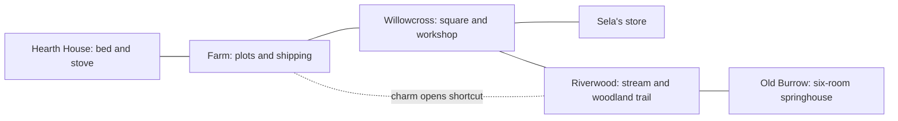

# TinyFarm MVP design proposal

**Working subtitle: The Sleeping Spring**  
**Status: approved for Gate A execution; later campaign gates remain deferred**  
**Audit date: October 3, 2026**

Implementation status and review evidence: [Gate A report](../milestones/tinyfarm-mvp-gate-a-report.md). The audit below records the pre-implementation baseline; later gates remain deferred.

## 1. The game we should make

TinyFarm is a small, complete fantasy action RPG about making a home at the edge of an enchanted wood. Grow ingredients, cook provisions, get to know three neighbors, and venture into an abandoned springhouse whose tangled heart has stopped the village stream. Bring its water home, then celebrate with a meal made from your own harvest.

The player fantasy is **a capable adventurer with a home worth returning to**. The farm supplies the journey; the journey changes the farm and village. A good session contains both care and adventure, with a visible result from each.

My recommendation is a **90–150 minute first-play campaign**, typically spanning **five to eight player-paced game days**, followed by optional free play in the same small world. This is a finished miniature game with a beginning, meaningful progression, a boss, and an ending. It should establish whether TinyFarm is enjoyable before we expand its size.

The reference direction comes from the user's request. For TinyFarm, I interpret *A Link to the Past* as readable overhead movement, direct attacks, designed rooms, secrets, and an ability that opens routes; I interpret *Rune Factory 4* as the mutually useful relationship between cultivation, cooking, adventuring, and village life. Nintendo's [official LTTP manual](https://www.nintendo.com/es-es/games/oms/snes-classic/manuals/zelda/manual.pdf) describes sword/item controls and field/dungeon exploration; the [official RF4 farming-and-fighting page](https://runefactory.com/rf4/farm.html) connects crops, dishes, equipment, combat, and town relationships. The design below is an original, deliberately smaller interpretation of that brief.

### Product commitments

1. **Adventure is the spine.** An authored dungeon, earned ability, and visible restoration give the campaign direction.
2. **Home supports adventure.** Crops become useful meals, money, and gifts. Returns home provide recovery and anticipation.
3. **Readable actions feel good.** Moving, swinging, dodging, watering, harvesting, and talking deserve finished feedback before more systems are added.
4. **A coherent place beats a large catalog.** Every shipping scene uses one art language and has a composition purpose.
5. **Warmth with real stakes.** Enemies can hurt you; defeat costs a little time and consumables, while permanent progress survives.

## 2. Current-work audit

The checkout was clean at the start of this audit. I inspected the native application, input handling, resolver, world/content definitions, existing presentation evidence, and the M25 defect ledger. A current Release build of `TinyFarm.slnx` succeeded with zero errors and 14 warnings in vendored OpenFont code. This audit did not conduct a fresh manual playthrough or rerun every historical proof. Visual observations use the saved native captures below; their age and scope matter.

| Area | What exists in the current checkout | Product judgment |
|---|---|---|
| Playable campaign | Default native app loads M21 content into the short supper scenario. Plant a seed, collect mint/mushrooms, cook, defeat a slime, return to Mara | A useful integration slice, but largely a checklist. Planting counts before the crop matures |
| Movement and space | Resolver-owned continuous coordinates, collision/navigation/interaction, scene routes, semantic spatial authoring | Strong foundation. Current native input prioritizes horizontal movement when both axes are held; diagonal movement needs deliberate product treatment |
| Combat | Timed move definitions and contact/field infrastructure; default content has one one-health slime; README explicitly says it cannot hurt the player | Contact resolution is reusable. Enemy behavior, player damage, defensive play, encounter design, and readable animation are unfinished product work |
| Farming and economy | Plant/water/harvest, day-based crop growth, seed/product transactions; default crop is a three-day turnip | Real semantic machinery exists. Its pacing is poorly coupled to a 5–10 minute supper objective |
| Cooking and gathering | Concrete forage node, woodcutting, one mushroom recipe and cooking station | Reuse transactions; add choices and actual food effects. Current recipe output is mainly an objective token |
| Village life | Mara, Elias, Sela; authored schedules and dialogue with persistent consequences | Enough cast for this MVP. They need distinct roles, authored conversations, and player-visible usefulness |
| Energy and clock | Persisted energy/rest; a game minute every five real seconds by default | Foundation exists, but current energy is not a finished player-facing work/provision economy. The clock would take about 80 real minutes to traverse 06:00–22:00 |
| Presentation | 1080p default, resize, optional HUD/inspector/capture, larger painterly trees/house in Riverside | Technical isolation works. Most scenes still use the earlier atlas presentation; the best art is concentrated in one showcase scene |
| Visual cohesion | Painterly meadow/tree/house alongside crisp pixel character, well/lantern, flat path/bridge, cyan rectangular water | Largest visual problem is inconsistent treatment of the whole scene, rather than insufficient detail in one PNG |
| Audio | Audio event projection and generated PCM tones; an eight-second repeating musical resource | Mechanism is present. Authored sound, ambience, and musical pacing remain polish work |
| Persistence and inspection | Semantic saves/replay, native capture, live inspection | Keep these foundations. Shipping play should not ask the player to understand engine concepts |
| Controls and UI | Contextual interactions, fixed hotbar, big quest/status/control panels; logical gamepad bindings | Current README says physical gamepad events are not collected. Combat/tool selection and shipping HUD need a cohesive control pass |

### What the visual audit shows

The [M25 clean Riverside frame](../../artifacts/tinyfarm-high-fidelity-presentation-m25/world-only-1080p-after.png) demonstrates a useful material direction: warm roof tiles, soft foliage, and enough resolution to read their detail. It also shows a pasted-looking flat path, a bridge without convincing bank connections, foreground foliage hiding the player, and a shoreline that reads as a feathered rectangle. The large meadow texture dominates visual detail while traversable ground and target silhouettes are less clear.

The [saved farm gameplay frame](../../artifacts/aurelian-full-game-slice-m9/02-farm-gameplay.png) and [Old Burrow frame](../../artifacts/aurelian-full-game-slice-m9/06-secondary-scene.png) show the older prototype's repeated atlas ground, oversized panels, weak encounter composition, and sparse world storytelling. These are historical captures, not claims about a fresh October native session. Current renderer code still applies the special painterly ground/bridge composition to the live-field scene, confirming that the broader art coverage gap remains relevant.

The [M25 ledger](../research/tinyfarm-visual-defect-ledger-m25.md) recommended a shoreline pass. Under this new product brief, I would broaden that into **a whole-scene style and readability standard**, demonstrated on the actual farm-to-dungeon play loop. Making the shoreline attractive alone would still leave the player, combat, and other locations feeling like separate prototypes.

### Polish priority

| Priority | Pressure | Why it matters |
|---|---|---|
| P0 | Movement, aiming, swing, enemy telegraph, damage, dodge | The central adventure must be playable and enjoyable |
| P0 | One coherent world style, player silhouette, shoreline/path/door readability | The player needs to understand and want to enter this place |
| P0 | Actual crop → meal → expedition → reward loop | Farming needs a purpose beyond checking a box |
| P1 | Clear daily rhythm, shop/cooking usability, compact HUD, save/continue | Sustains a full campaign without friction |
| P1 | Three distinct neighbors, restoration beats, music/sound | Gives the loop a home and a reason to finish |
| P2 | More crops, weapon families, regions, simulation depth | Expansion should follow evidence that the small game works |

## 3. Scope contract

Content counts are ceilings for the first release. Tuning numbers later in this spec are starting targets, not assertions that they are already balanced.

| Category | MVP scope |
|---|---|
| Platform | Windows native desktop; keyboard and Xbox-style controller; single player |
| World | Three outdoor areas, two interiors, one six-room dungeon: eleven authored spaces total |
| Home | One fixed farmhouse, stove, bed, shipping box; 12 prepared plots expandable to 24 |
| Crops | Three: turnip, mintleaf, sun squash; four visual stages each |
| Wild resources | Two forage ingredients, wood, and one dungeon upgrade material |
| Cooking | Four fixed recipes at one station |
| Combat | One sword moveset, one dodge, one earned ability; three regular enemy types and one boss |
| Progression | One sword upgrade, one heart-capacity upgrade, one farm expansion, one ability unlock |
| Cast | Mara, Elias, Sela; one personal request and one short follow-up scene each |
| Quest content | Three main objectives and three optional personal requests; one tracked objective at a time |
| Secrets | Three authored rewards: one ability route, one environmental observation, one optional combat reward |
| Ending | Stream restored, changed outdoor scene, shared supper, short credits; continuing the same save remains possible |

Deferred: additional dungeons, seasons/weather simulation, romance/marriage, monster taming, companions, livestock, fishing/mining minigames, house decoration, procedural terrain/dungeons, multiplayer, skill trees, XP ladders, random equipment affixes, crop quality/soil chemistry, tool durability, and elaborate crafting. The four named progression rewards give this miniature RPG a complete arc without those systems.

## 4. Story, cast, and world

You take over an unused cottage beside Willowcross, hoping to grow a little food and stay a while. The village's old spring has weakened; the bank is muddy, the mill is idle, and the abandoned springhouse is overgrown. Its guardian has become trapped in a knot of roots and stagnant magic. Repairing the spring is a practical favor that turns into an adventure.

The tone is warm, curious, and mildly uncanny. Monsters are fantastical obstacles with readable personalities. Characters have small concerns and humor, rather than speeches about a world-ending threat. Clearing the dungeon releases its guardian instead of presenting ecological destruction as the goal.

| Character | Role and personality | Main contribution | Personal request / relationship payoff |
|---|---|---|---|
| Mara | Botanist; observant, slightly stubborn, excited by plants | Explains the spring and the found charm; supplies the starter crop lesson | Grow mintleaf for a shared tea; a conversation about why she stayed in Willowcross |
| Elias | Carpenter and former mill worker; practical, dry humor | Makes the sword improvement and farm expansion | Bring wood to repair the riverside bench; visible repaired bench and a short memory of the mill |
| Sela | Shopkeeper and cook; sociable but careful with resources | Seeds, recipe unlocks, and an affordable supply fallback | Deliver sun squash for supper; new shop display and a short gathering with the others |

Each has a morning and afternoon destination plus an evening home position. Their journal entry says where they can be found. Main quest interactions remain available through a clear home location after hours; nothing expires. No numerical friendship bar or repeat-gift grind. Completing each personal request changes dialogue and earns its authored scene.

### Spatial layout

Recompose existing scene IDs where practical. The prototype's abstract overworld connector becomes a short, purposeful part of Riverwood rather than a separate empty travel scene. Hearth House and the store stay small. No routine home-to-village or village-to-dungeon trip should take more than about a minute; the full outward trip targets under two minutes. Doors are identifiable from their thresholds, approach space, and silhouettes without floating labels everywhere.

The farm has a clear entrance, visible bed/stove access, rows of prepared soil, and a sightline toward the stream. Riverwood gives a safe gathering nook, an optional fight, a visible blocked shortcut, and a framed dungeon entrance. Tree canopy should frame movement corridors rather than conceal targets. Dungeon geometry is authored for combat and discovery; repeated resource tiles do not constitute room design.

## 5. The campaign and the first session

### Main progression

1. **Make a home.** Harvest a starter plot, cook broth, plant and water your own turnip, meet the neighbors, and inspect the stream. Starter plots contain two mature turnips so the opening immediately demonstrates harvest and cooking; these do not satisfy the later own-grown harvest objective.
2. **Wake the spring.** Explore Old Burrow, obtain the Briar Charm, open its inner route, defeat the Rootbound Warden, and restore the stream. Returning with dungeon materials can fund a sword upgrade; it is helpful rather than required.
3. **Bring the harvest home.** Harvest at least one crop planted by the player, then cook Field Stew and attend supper. The restored water, repaired setting, and conversations make the ending a consequence of play. The gathering can happen whenever ready; it has no calendar deadline. The starter meal cannot satisfy the final cooking beat: track the accepted cooking action after the own-grown harvest.

Personal requests can be completed alongside this arc. The player's planted-crop provenance must be represented by game state, rather than inferred from current inventory or the starter tutorial harvest.

### Opening 20 minutes, target experience

| Time | Experience | What the player understands |
|---|---|---|
| 0–2 min | Start directly at the cottage; step into the garden; harvest a mature turnip | Movement, interaction, home identity |
| 2–5 min | Plant/water a plot, cook broth; meet Mara nearby | What a plot needs and why food matters |
| 5–9 min | Visit the square; meet Sela/Elias; see stream trouble and dungeon route | Who lives here and where adventure begins |
| 9–13 min | Gather mushrooms; face one generously telegraphed slime | Sword, dodge, damage, healing |
| 13–18 min | Enter the first two dungeon rooms; find a useful reward and a glimpse of the sealed inner route | Exploration has designed progression |
| 18–20 min | Return by a safe exit, eat or sell supplies, sleep; see crop growth | A complete home–adventure–home loop |

These times are playtest targets. A player who reads slowly should still have agency; the game does not rush them through dialogue. The existing supper checklist becomes the ending theme, rather than a mandatory list that fills the HUD from the title screen onward.

## 6. Day rhythm, farming, and economy

### Clock and recovery

The outdoor day runs 06:00–22:00 in approximately 16 real minutes, initially one game minute per real second. Dialogue, menus, focus loss, and paused screens freeze gameplay. **Dungeon exploration freezes the day clock while movement, combat, and effects continue.** This lets the village keep a daily rhythm without timing out a boss fight. These rates use the existing authoritative host; they require an explicit distinction between calendar and active simulation progression.

Sleep is available at home whenever the player chooses. It advances to the next morning, resolves crops/shipping/restocks, fully restores health and energy, and autosaves. At 22:00 outdoors, warn and return the player home with no monetary penalty; apply one normal overnight transition. No crop dies because a day was missed. A player may finish faster by sleeping early, or continue after the ending indefinitely within the same season.

### Farm interaction

Use a small prepared garden with discrete plots, not free placement across the whole map. The four work tools are hoe, watering can, seeds, and axe. Hoe prepares an empty plot, seed plants the chosen crop, water supplies that day's growth, and interact harvests a mature crop. A preview highlights the exact plot before use. Full bags and missing seeds produce a short actionable message.

| Crop | Watered nights to mature | Yield | Role | Starting economy: seed / sell per item |
|---|---:|---:|---|---:|
| Turnip | 1 | 2 | First harvest, reliable broth and income | 4 / 4 coins |
| Mintleaf | 2 | 2 | Energy tea, Mara's request | 6 / 7 coins |
| Sun squash | 3 | 1 | Strong stew, Sela's request, valuable sale | 8 / 18 coins |

Each crop grows at most once per overnight transition if watered. Mature crops stay available; skipped watering pauses growth. Harvest empties the plot and leaves it prepared. There is no regrowth, quality roll, fertilizer, or seasonal eligibility in MVP. Crop appearances distinguish prepared soil, watered soil, seedling, growing plant, and ready harvest; the four plant stages are separate from soil state.

Start with 30 coins, six turnip seeds, two mintleaf seeds, all basic tools, two mature tutorial turnips, and one Field Stew. All three crop seeds are sold from day one. The two wild ingredients are mushrooms and berries: mushrooms support cooking, while berries can be eaten directly for 2 HP or sold for 2 coins. Both respawn overnight in bounded authored nodes; an initial forage pocket is safe. Basic seeds are always stocked, and there are no fees to sleep or retreat. The player can recover from spending all money by gathering and selling ingredients.

Energy begins at 100. Initial costs: hoe 2, plant 1, water 1, chop 4; harvest, walk, talk, sword, dodge, and charm cost no energy. At zero, expensive farm work is unavailable with a clear prompt; adventure and gathering remain possible. Food or sleep restores it. Existing passive energy drift should be replaced by this intentional policy for the shipping campaign rather than stacked on top of it. Farm work should take approximately one to two minutes for 12 plots, leaving most of the day for other choices.

### Money and upgrades

The shipping box accepts ordinary produce and gathered resources and pays at the next morning. The store supports immediate sale for the same price, plus purchases; separate rates would add bookkeeping without helping this MVP. Important tools/quest objects cannot be sold. Shipping confirmation previews quantity and return.

Three optional purchases are the whole upgrade economy:

- **Tempered sword:** 50 coins + 3 wood + 1 spring shard; raises ordinary sword damage from 2 to 3 HP.
- **Heart pendant:** 60 coins + 2 spring shards; maximum health rises from 12 to 16 HP.
- **Garden extension:** 40 coins + 6 wood; twelve additional plots visibly opened by Elias.

Spring shards are fixed dungeon cache rewards. Three are guaranteed across the six rooms, permitting both gear upgrades without drop farming. Respawning enemies do not generate more shards. No upgrade is mandatory for the boss, and the boss's required charm is free. Wood is available from a small set of renewable marked saplings; felling never removes essential navigation or quest objects.

## 7. Cooking, bags, and useful preparation

One stove, four known recipes, and explicit quantities. The recipe list previews missing ingredients and the result. Starter broth is available immediately; the remaining three recipes arrive through the introductory conversation with Sela, without a license system.

| Recipe | Ingredients | Effect |
|---|---|---|
| Turnip Broth | 1 turnip | Restore 4 HP |
| Mushroom Sauté | 1 wild mushroom | Restore 25 energy |
| Mint Tea | 1 mintleaf | Restore 40 energy |
| Field Stew | 1 turnip + 1 sun squash + 1 wild mushroom | Restore 8 HP and 30 energy; ending supper dish |

Eating takes a short, interruptible action in active combat; menus pause, and consuming from a menu applies the same action after returning to gameplay. The equipped food has a dedicated quick-use button. No permanent food buffs, recipe skill levels, or elemental resistance table. Prepared food is useful and finite, and an easy meal makes a return to farming worthwhile.

Bag target: 16 stack slots, up to 99 units per ordinary stack. Tools, the sword, and quest objects occupy separate fixed equipment/key-item space. Existing identity items and stack products remain distinct internally. Quick access shows sword, charm, selected work tool, and selected food; it is not an eight-slot inventory spreadsheet. A full bag must never destroy a crop or cache reward: preflight the transaction, then keep the world object available if it cannot fit.

## 8. Movement and combat

### Controls and movement

Eight-direction continuous movement with normalized diagonals, four-direction facing/animation, no pointer aiming requirement. Attack and charm follow facing; a swing works even if there is no preselected enemy. Movement, attack, and interaction should not compete for a contextual button.

| Action | Keyboard proposal | Xbox-style controller proposal |
|---|---|---|
| Move | WASD | Left stick / D-pad |
| Sword | J | X |
| Dodge | Space | B |
| Interact / confirm | E / Enter in menus | A |
| Selected work tool | K | Y |
| Briar Charm | L | Right trigger |
| Quick food | R | Left trigger |
| Cycle work tool / seed | Q / Tab; bag for direct selection | Left/right bumper; bag for direct selection |
| Bag / journal / pause | I / M / Escape | View / menu tabs / Menu |

These replace the prototype's sword-in-slot-four ritual. Move the old global Q-quit and Shift-F interaction binding out of the shipping gameplay profile; quit belongs to pause/title. Physical gamepad collection and all navigation/confirmation paths must be verified before claiming controller support. Existing F9/F10/F11 presentation controls remain available for evaluation.

### Combat rules

Health starts at 12 HP, visually six hearts. Ordinary enemy attacks deal 2 HP; clearly signaled boss heavy attacks deal 4. After damage, give roughly 0.7 seconds of invulnerability and restrained knockback. Hit flash, sound, and animation communicate the event; color alone never defines an attack.

The sword has one fast directional arc, a readable anticipation/active/recovery sequence, and one buffered next attack. Keep the existing approximately 0.3-second swing as a tuning starting point. Enemies take multiple hits, react briefly to damage, and cannot all stack overlapping attacks through an invulnerable player. A small hit pause may affect visual playback; authoritative outcomes remain deterministic.

Dodge is a short directional step, initially about 0.25 seconds with 0.6-second cooldown and a clearly bounded invulnerable interval. It cannot cross collision or water. There is no stamina cost or animation-cancel combo tree. Sword recovery has a deliberate dodge-escape rule; test it rather than leaving it an accidental renderer behavior.

The **Briar Charm** sends a short vine in the facing direction. It tugs marked root rings and staggers a vulnerable enemy; it costs no energy and has a cooldown, initially 1.5 seconds. It opens the dungeon's route, an outdoor shortcut, and the boss's protected core. Range/occlusion is semantic and the same whether the vine image is hidden or visible. No platform traversal, grappling physics, elemental spell system, or general-purpose object pulling.

| Enemy | Readable behavior | What it teaches |
|---|---|---|
| Moss slime | Squash anticipation, then a short hop/lunge; 4 HP | Step aside, approach, strike |
| Thorn sprout | Roots in place, raises head before one straight projectile; 6 HP | Read a line of danger and approach from another direction |
| Burrow beetle | Turns toward player, winds up, charges, then exposes its back; 6 HP | Bait commitment, dodge, punish recovery |
| Rootbound Warden | Alternates a marked root-line attack and a charge; charm its exposed root ring to open a sword window | Apply the learned ability and the two defensive readings |

Enemy attack telegraphs target roughly 0.5–0.8 seconds, with slower teaching variants in the first encounters. Active fights use at most three regular enemies. Boss has two phases using the same vocabulary, adding a second root line in phase two; target two to four minutes for a first successful attempt. No invisible damage, projectile spam, or camera-obscured attack origins.

At zero HP, return to the dungeon entrance with half health, preserve inventory/quest/upgrades and opened shortcuts, and restore enemies in uncleared combat rooms. Used meals remain spent. Dungeon clock remains frozen. A safe return home is always available; no money loss, corpse retrieval, or lost crops. Reloading a pre-fight save restores that save normally. Completed rooms and the boss do not respawn before the ending; optional post-ending rematches are outside scope.

## 9. Old Burrow: six designed rooms

| Room | Purpose | Encounter / discovery |
|---|---|---|
| 1. Threshold | Safe arrival and retreat point | Stream diagram, shrine/save point, visible sealed return route |
| 2. Moss chamber | First dungeon fight | Two slimes, fixed supplies; opening shortcut back to threshold |
| 3. Keeper's alcove | Ability acquisition | One sprout, Briar Charm chest, harmless root ring teaching action; shard cache |
| 4. Rootworks | Apply ability | Two marked rings in a short ordered sequence; sprout + beetle encounter; shard cache |
| 5. Spring basin | Preparation and boss preview | Visible guardian, third shard cache, optional beetle reward, shortcut to threshold |
| 6. Heart of the spring | Boss and restoration | Warden fight, free the guardian, water restoration reveal and safe exit |

Room 4's sequence is bounded authored state with an obvious reset, not a new puzzle scripting language. Players see the obstacle before receiving the charm. The three secrets are an outdoor root-ring route with 30 coins, a visibly suspicious alcove with two broths, and Room 5's optional combat nook with 20 coins. The main shortcut unlocks independently of collecting the outdoor reward. Rewards are fixed and shown in the map/journal as found when discovered.

The dungeon should support two or three outings for a novice, but a skilled player can complete it in one prepared outing. Food and gear make it easier; mandatory crop-grinding gates would undermine the adventure pacing.

## 10. Art direction: painterly clarity

Use **illustrated storybook fantasy**, with simplified shapes and selective material detail. Keep the warm cream/terracotta house, mossy foliage, and soft painted color relationships established by M24/M25. Bring characters, ground, props, dungeon walls, crops, and effects into that same treatment. The existing large tree source is a useful material reference, not permission to make every canopy enormous.

### Projection and composition

- Fixed north-up, three-quarter orthographic **art convention**, nominally about 45 degrees above the ground, viewing north with zero horizontal yaw. Follow the [approved projection contract](../research/tinyfarm-art-projection-contract-m25.md).
- Building ridges/eaves stay horizontal; show roof plus shallow south facade, without a large rotated side wall. Character and prop views share this convention.
- Retain the existing semantic ground plane and camera mechanism. A new 3D camera is not a prerequisite. All assets must be previewed together in an actual scene; if their apparent ground depth is inconsistent, adjust the controlled art rather than silently changing navigation projection.
- Frame destinations, exits, walkable corridors, and encounter space. Camera movement is steady; entrances cannot pop the player behind a canopy. Dungeon rooms keep relevant telegraphs and exits visible.
- House/trees may contain rich detail; walkable ground uses quieter, larger value shapes. Detailed grass should not drown out the player, pickups, wet soil, or threats.
- Water has a shaped shoreline, bank thickness, shallow-edge transition, and bridge connections. Gameplay wet/dry geometry stays authoritative; a giant feathered rectangle is not an accepted shoreline.

### Style and readability rules

Player silhouette: one original adventurer/gardener in a blue coat, warm scarf, boots, and restrained straw hat or hood. Eight-direction movement uses four principal painted views; the dark boot/ground contact and light head/scarf remain readable against green ground. Distinct villagers get three silhouettes/colors. No shared player-looking sprite for every NPC.

At 1080p, target roughly 70–95px visible standing character height excluding transparent padding. The player must be easy to locate, but should not read as a giant beside the doors. Size terrain, entrances, crops, and encounters together in a reference scene. Source resolution and semantic metres do not decide screen proportions by themselves. Camera scale is tuned once from that reference scene, then scales uniformly through 720p/1080p/1440p; this is a presentation adjustment requiring fresh captures.

Use painted forms with restrained edge accents rather than mismatched heavy pixel outlines. Canopies fade locally when covering the player; a faint silhouette is a fallback, not the main visual design. Interior/dungeon values are darker but preserve actor/telegraph contrast. Teal/green may suggest friendliness, warm amber destination cues, and coral danger, always supported by shape/motion.

The immediate art acceptance set is one complete gameplay scene containing player, NPC, house, garden, path, shore, bridge, trees, a pickup, a slime, and HUD. Approve its coherence before producing the full catalog. Vector guides or simple blockouts should constrain difficult house, bridge, dungeon, and character poses. Generated work is reviewed for geometry, style, alpha, and animation consistency and stored as approved local art; generation is a production step, not a runtime dependency.

Animation minimum: four-direction idle/walk for player and villagers; player swing/dodge/tool-use/damage; enemy anticipation/attack/recovery/damage/defeat; visible boss states; crop watering/harvest feedback. Short consistent animation sequences are more valuable than new static concept paintings. Budget atlas size and runtime variants from actual display footprints; painterly art uses linear sampling, with alpha-aware mipmaps only when measured movement/minification warrants them.

## 11. UI, sound, and presentation polish

Shipping HUD: small health/energy group, day/time, selected tool/charm/food with contextual inputs, and at most one short tracked objective. Money appears in shop/bag or on change. Full requests and NPC destinations live in the journal. No persistent controls paragraph, large right-side checklist, world-border panels, or engine statistics in ordinary play.

Pause provides continue, save, load, help/controls, volume, and quit. One active save plus its previous good backup is enough. Autosave on sleep and at safe dungeon checkpoints; manual save from pause records stable gameplay, with autosaves held until an attack resolves. Continue should restore a valid readable pose rather than a half-played hit animation. Existing persistence/dialogue restoration owns semantic correctness; add explicit new fields/versioning for proposed mechanics as needed. Historical proof/save fixtures remain supported according to existing compatibility rules, while the new campaign's content identity is explicit.

F9/F10/F11 continue to support evaluation. The HUD always overlays world geometry. Help/tutorial hints appear on first use and can be revisited; journal text describes outcomes, not resolver internals. A simple discovered-room dungeon map and the small world map are enough. Menus must be fully keyboard/controller usable; no mouse-only affordances.

Sound budget: two authored music loops (home/village and dungeon), one boss variation, one ending phrase, environmental river/wind layers, and a small consistent effect set for work, steps, swing, hit, danger, harvest, pickup, eating, doors, and confirmation. Audibility communicates telegraphs and action completion. Replace prototype sine tones in shipping content. Master/music/effects sliders, restrained screen shake with off option, no flashing dependency for danger, and readable text at 720p are MVP requirements.

## 12. What to reuse and what to change

| Reuse as foundation | Game-specific work still required |
|---|---|
| Core state/intents/resolver, semantic collision/navigation/interaction | Player health, enemy actions/projectiles, dodge, charm, room/puzzle progression, explicit work-energy rules |
| Timed combat/contact mechanisms and existing cadence | Directional attacks without requiring a target ID, authoritative hurt/defeat, bounded enemy behavior, animation/feedback realization |
| Crop/product/inventory/cooking transactions and content loader | Three crop definitions, four food effects, usable menus/transactions, own-grown harvest provenance, bag capacity |
| Existing scene/schedule/dialogue mechanisms | Reauthored map/layout, three character arcs, six requests, time policy that freezes calendar while dungeon simulation runs |
| Existing chunked saves and replay verification | Explicit schemas/content identity for new state, safe autosave/manual policy, migration validation |
| Existing camera/native rendering, sampling, DPI/resize, HUD separation | Cohesive scene realization, player/actor animation, readable canopies, shore/path/bridge art, compact HUD |
| Existing audio/effects projection and inspection | Authored content and player-facing feedback; debug hidden by default |

The existing live water field may remain a visual response layer for ripples and interactions. The campaign does not require fluid puzzles or combat-to-water damage propagation. If the current water transport cannot meet composition/readability/performance goals, simplify its visible realization locally while preserving semantic wet/dry and any existing compatibility contracts. A fluid-engine expansion is not the MVP's critical path.

Build game-owned content and policy through the present owners. No new general RPG framework, quest language, inventory architecture, scene graph, editor, or camera system should be a prerequisite for these named behaviors. Preserve resolver authority and one movement engine. Tooling improvements earn a place only when they unblock a concrete scene or player action in this spec.

## 13. Execution after review

Build playable experiences with shared quality gates, rather than a new sequence of disconnected technology demonstrations. Do not estimate calendar dates until the first integrated slice establishes animation/content production cost.

### Gate A — prove the intended game in ten minutes

Deliver a normal native launch with one coherent garden/home area, the Riverwood approach, and one real dungeon encounter. Player can move diagonally, harvest a starter crop, cook/eat, plant/water, fight an attacking slime, dodge, retreat, sleep, and see their own crop grow. Use the target art language for everything visible in this route, including the player, path, water, and HUD; block out the rest of the world clearly as unfinished.

**Exit:** a fresh player completes this loop without developer coaching, describes why farming helps adventure, and can read attacks/targets. Approve a world-only and ordinary-HUD frame plus a short continuous play recording. This gate tests both feel and art production; rendering a polished farmhouse alone does not pass it.

### Gate B — finish the miniature campaign

Complete the eleven spaces, six-room dungeon, charm/three enemies/boss, all crops/recipes/rewards, three villagers, ending, and continuing save. Use the approved reference-scene production standard. Maintain a complete playable build while replacing content placeholders. The end-to-end route, defeat/retry path, and spent-money recovery path must work without debug commands.

**Exit:** a new save can reach the ending; farming and rewards materially change expedition preparation; no mandatory repeated enemy/drop grind; no missing art/animation in campaign-critical scenes; safe save/load through each progression boundary.

### Gate C — finish and qualify the release candidate

Tune travel/day/food/damage/economy against actual play, then complete controllers, audio mix, readability, menus, performance, and save compatibility. Review a continuous full campaign, not only screenshots or headless proofs.

**Exit:** all acceptance criteria below pass, or a specific unmet criterion is reported honestly. Expansion waits for this decision.

## 14. Definition of a successful MVP

### Player evidence

- In at least five first-time play sessions, at least four players complete the opening farm–fight–return loop without live coaching, understand how to obtain food, and identify the next destination. Record actual observations rather than inventing results.
- Most first-time campaign runs target 90–150 minutes; slower readers and early sleepers are supported. Unexpectedly long waits/travel trigger retuning before adding content.
- Players can explain at least one useful reason to farm and one reward brought home from exploration. Someone who dislikes farming can still recover/finish through a small garden and safe forage, while farming provides appreciable preparation advantage.
- A player can locate themselves, doors, pickups, plots, and enemy danger without the HUD. Attack origins remain readable in every authored encounter.
- The restored stream, garden growth, earned shortcut, and supper make completion visibly different from the start.

### Functional and polish evidence

- Normal release launch, new game, continue, complete campaign, post-ending continue, and keyboard/controller menus work on the declared platform.
- All three crops visibly grow; four recipes produce their declared effects; sales/upgrades cannot double-charge or discard items on failure.
- Damage, dodge, charm, room state, rewards, crop provenance, sleep, and defeat/retry pass semantic save/load/replay checks. Rendering/HUD/resolution changes do not change accepted gameplay outcomes.
- Save interruption retains a previous valid save; new game never silently overwrites a continuing save. No quest softlock after consuming, selling, skipping a day, or missing a scheduled NPC.
- 1280×720, 1920×1080, 2560×1440, and a non-16:9 resize preserve projection/readability; high-DPI framebuffer behavior is measured on a scaled desktop before qualification.
- Initial hardware reference is the existing RTX 3070 development machine: target 60fps at 1080p and 1440p, warmed p95 host frame ≤16.7ms and p99 ≤25ms in representative combat/travel. Report worst frames and separate GPU/CPU evidence where available. This is a proposed gate, not the current measured performance claim or a declared minimum PC specification.
- No routine texture reuploads, runaway retained history, or unbounded effects during a 30-minute representative play session. Profile real scenes and preserve gameplay/art quality while resolving bottlenecks.
- Shipping frames contain no placeholder atlas repetition, flat rectangular river seam, mismatched pixel characters, engine inspector, instructional wall of text, or missing animation in the campaign route.

## 15. Review decisions and principal risks

The proposal makes five deliberate commitments for review: **a finite 90–150 minute campaign; one dungeon; farming as useful expedition preparation; a cohesive painterly world with animated actors; and three neighbors with small authored arcs.** More farming-sim depth, romance, monster companions, or a second dungeon would change the production scope substantially and should be conscious revisions.

The highest risk is consistent animated art, followed by combat feel. Existing infrastructure does not prove those qualities. Gate A resolves both early with actual play. A second risk is making farming a tax: one-day turnips, ready starter harvests, short chores, paused dungeon time, and nonmandatory upgrades are intentional protections. A third is ending up with an attractive diorama: scene composition must support movement, threats, targets, and returns home, and be evaluated in motion.

**Recommendation:** approve this bounded game design, then execute Gate A as a coherent sample of the final product. Review its playability and visual language before expanding to the rest of the campaign. The present work stops at this spec for your review.

## Audit source index

Primary local sources inspected:

- [Player-facing README](../../Games/TinyFarm/README.md), [native application](../../Games/TinyFarm/TinyFarm.Native/Program.cs), and [game policy](../../Games/TinyFarm/TinyFarm.InputMan/TinyFarmGame.cs).
- [Supper start](../../Games/TinyFarm/TinyFarm.Runtime/TinyFarmSupperStart.cs), [objective law](../../Games/TinyFarm/TinyFarm.Core/TinyFarmSupper.cs), and [existing walkthrough](../../Games/TinyFarm/TinyFarm.InputMan/TinyFarmWalkthrough.cs).
- [Resolver](../../Games/TinyFarm/TinyFarm.Core/TinyFarmResolver.cs), [world models](../../Games/TinyFarm/TinyFarm.Core/WorldModel.cs), [combat moves](../../Games/TinyFarm/TinyFarm.Core/TinyFarmCombatMoves.cs), and [host cadence](../../Games/TinyFarm/TinyFarm.Runtime/TinyFarmSimulationHost.cs).
- Content under [runtime Content](../../Games/TinyFarm/TinyFarm.Runtime/Content), particularly M18 forage, M19 cooking, M20 products/trees, M21 enemies/scenes, and authored NPC schedules.
- [Native renderer](../../Games/TinyFarm/TinyFarm.Native/TinyFarmNativeRenderer.cs), [UI](../../Games/TinyFarm/TinyFarm.Native/TinyFarmNativeUi.cs), [input profile](../../Games/TinyFarm/TinyFarm.InputMan/GameControls.cs), and [audio projection](../../Games/TinyFarm/TinyFarm.Runtime/TinyFarmAudioProjector.cs).
- [M25 report](../milestones/tinyfarm-high-fidelity-world-presentation-m25-report.md), [projection convention](../research/tinyfarm-art-projection-contract-m25.md), and [visual defect ledger](../research/tinyfarm-visual-defect-ledger-m25.md).

No gameplay code or assets were changed for this proposal. Existing memory helped locate the M24/M25 foundations; present-tense findings above were checked against this checkout. Historical test counts and captures are not treated as fresh October play qualification.
