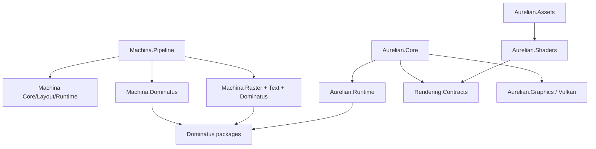
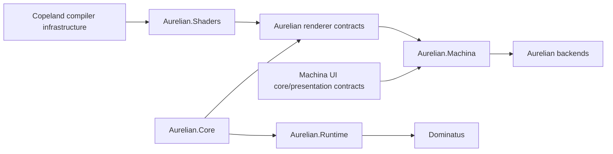

# JTF-M1 — Semantic overlap and contract boundary audit

## Status and executive diagnosis

JTF-M1 is an audit and plan; it changes no production source, project edge, API, or behavior. JTF-M0 separated physical territories, but three historical vertical slices still confuse semantic stages:

1. `Machina.Pipeline` combines UI lowering/layout/hit testing with Dominatus dispatch and CPU pixels.
2. Aurelian has sound renderer-neutral contracts, but `Aurelian.Core` also contains concrete Vulkan adapters and a generic presenter stack whose meaning is broader than the engine.
3. `Aurelian.Shaders` mixes potentially reusable compiler mechanics with intentionally Aurelian-owned shader language, backend, and engine artifact meaning.

The decisive boundary is a small Machina-owned presentation frame consumed by an Aurelian-owned adapter. This lets M2 cut the semantic seam before moving implementations, minimizes dual paths, and avoids a universal IR.

## Evidence inspected

The audit inspected `AGENTS.md`; all production and test project files and solution membership; JTF-M0 doctrine/migration and validator exceptions; Machina pipeline, Dominatus, raster and text sources; Aurelian core screens/frame input/Vulkan adapters, graphics contracts/backends, runtime/Dominatus, visible-triangle host, shader frontend/VD-MIR/HLSL/DXC/artifact code; representative tests; subsystem architecture/reference documents; and the M13/M14 historical records explaining VD-MIR, visible presentation, screen stacking, and world screens.

## Current production dependency graph

Edges omitted below are ordinary same-subsystem leaf dependencies. The audit used every production `.csproj`; no cross-subsystem project reference currently exists.

Key complete edge facts: Copeland CLI references Markdown and Script; Machina Core references Layout; Standard and Runtime reference Core/Layout; Fonts is independent and Fonts.Tooling references Fonts; all three raster projects are Machina-internal; Aurelian Actuation references World; Assets references Rendering.Contracts and Shaders; AssetTool references Assets; Graphics and Null reference Rendering.Contracts; Runtime references World and Rendering.Contracts plus `Dominatus.Core`; Core references Runtime, Rendering.Contracts, and Graphics; Shaders references Rendering.Contracts.

## Target production dependency graph

The arrow indicates dependency from consumer to referenced producer contract except the layout above visually groups inputs into the bridge: concretely `Aurelian.Machina` references both Machina contracts and Aurelian contracts; neither references the bridge. Aurelian backends reference Aurelian contracts. `Aurelian.Core` does not reference a concrete backend.

## Project-level dispositions

| Project/family | Disposition | Target owner and decision |
|---|---|---|
| `Machina.Core`, `Layout`, `Standard`, `Runtime`, `Fonts`, `Fonts.Tooling` | Retain | Machina; UI semantics, layout, local runtime, typography/tooling. Keep tooling output backend-neutral. |
| `Machina.Pipeline` | Split | Retain lowering/layout/hit-test and presentation-frame production in Machina; move raster realization to Aurelian; remove orchestration glue after bridge proof. |
| `Machina.Dominatus` | Split | UI action ingress/local counter behavior can be re-expressed in Machina Runtime/sample; Dominatus actuation moves to Aurelian/integration; snapshots archive as proof; obsolete compatibility is removed later. No production assembly remains after M5 unless renamed/re-scoped as non-Dominatus Machina behavior. |
| `Machina.Renderer.Raster` | Move intact | Aurelian CPU raster backend: `Rgba32`, `RasterSurface`, fill/stroke rasterizer and PPM realization are concrete pixels. |
| `Machina.Renderer.Raster.Text` | Split | Text layout/metrics contracts stay Machina; bitmap/debug glyph pixel realization moves with Aurelian CPU backend. |
| `Machina.Renderer.Raster.Dominatus` | Split | Raster recorder/backend moves to Aurelian CPU renderer; Dominatus handler/registration is replaced by normal backend consumption and removed later; `RasterFrame` becomes an Aurelian backend artifact. |
| `Aurelian.Rendering.Contracts`, `Rendering.Null`, `World`, `Actuation`, `Runtime`, `Assets` | Retain | Correctly Aurelian-owned. Runtime's Dominatus dependency is legitimate engine orchestration. |
| `Aurelian.Core` | Split | Retain engine/frame/backend-neutral ports; move concrete Vulkan adapters out; move generic stack mechanics to Machina while retaining world-screen semantics/adapters in Aurelian. |
| `Aurelian.Graphics` | Retain | Vulkan backend/mechanism owner; receive Core's Vulkan adapters and later CPU raster backend (a separate Aurelian renderer project is preferred for CPU). |
| `Aurelian.Shaders` | Retain / Promote selectively | Shader lane remains Aurelian; only proven semantics-free infrastructure may be promoted to Copeland in M6. |
| `Aurelian.VisibleTriangle` | Archive (as proof) | Keep sample-host proof; platform input/window/present code is sample/backend-host mechanics, not reusable presenter doctrine. |
| future `Aurelian.Machina` | Bridge | Consumer-owned adapter, explicit cross-subsystem dependency. |

## Ambiguous public type-family dispositions

| Current public family | Disposition | Exact future responsibility |
|---|---|---|
| `MachinaRasterPipeline`, options, `MachinaFrame` | Split | A Machina pipeline returns lowering/layout/hit-test plus presentation frame; Aurelian CPU pipeline separately returns raster artifact. `ITextRasterizer` is not an option on Machina output. |
| `MachinaRenderBridge`, `MachinaTextRenderBridge`, `MachinaRenderOptions` | Split | Their lowering logic becomes Machina presentation-frame construction; Dominatus interfaces disappear. Viewport metadata stays. |
| `Begin/EndFrame`, `FillRect`, `StrokeRect`, `DrawText`, clip commands | Split | The UI presentation vocabulary, stripped of `IActuationCommand`, stays Machina. Aurelian has its own renderer vocabulary and the bridge translates. Frame begin/end may become frame envelope rather than commands. |
| `MachinaRenderPass` | Remove later | Dominatus OptFlow dispatch is orchestration, not UI lowering. |
| `UiActionEvent` | Retain | Interpreted UI action ingress belongs in Machina Runtime without Dominatus inheritance/dependency. |
| `CounterUiRuntime` | Archive / Split | Counter/local state is legitimate UI sample behavior; HFSM/AiWorld implementation is proof-only and replaced by Machina local runtime or sample code. |
| render snapshot recorder/writer/handler | Archive / Split | Deterministic textual oracle remains test tooling; Dominatus handler is removed. |
| `RasterSurface`, `Rasterizer`, `Rgba32`, `PpmWriter` | Move intact | Aurelian CPU backend and artifact export. |
| `ITextRasterizer`, bitmap/debug rasterizers | Split | Remove surface-coupled public seam; Machina resolves layout, Aurelian rasterizes glyphs/pixels. |
| `RasterRenderRecorder`, handler/registration/options, `RasterFrame` | Split | Recorder/frame move to Aurelian CPU backend; handler/registration removed after direct backend path exists. |
| `IPresenterScreen`, `PresenterScreenStack`, `ScreenLayerKey/Slot/Order`, `Layer` | Move intact | General composition belongs to Machina presenter. Preserve deterministic order and insertion stability. |
| `ScreenLayers` | Split | Generic UI layers move to Machina; `World` and any game-domain conventions remain Aurelian declarations/adapters. |
| visible-triangle world screen/stack | Split | World screen is Aurelian/sample; generic stack is Machina; stack runner that composes them becomes integration proof. |
| `IAurelianFrameInputProvider`, `AurelianFrameInput`, delegate provider | Retain | Engine frame input, not raw UI input. |
| Silk input/provider/backend | Split | Window/event pump and raw platform mechanics remain Aurelian sample/backend host; conversion to Machina input belongs in integration. |
| `ICompositorMechanism`, `IPresentationMechanism`, engine graphics options | Retain | Backend-neutral core ports/policy. |
| Core `Graphics/Vulkan/*` adapters | Move intact | Aurelian.Graphics or future Aurelian Vulkan backend; these directly mention swapchains and Vulkan compositor image sets. |
| shader lexer/parser/diagnostics/provenance families | Promote only with proof | Candidate generic mechanics; current SDSL/Shader types remain Aurelian until two lanes consume an extracted abstraction. |
| SDSL-V AST/validation/lowering and VD-MIR | Retain | Shader-domain compiler semantics remain Aurelian. |
| HLSL emitter, DXC discovery/compiler, SPIR-V emitters | Retain | Aurelian shader backend/toolchain. |
| `CompiledShaderProgram/Stage` contracts | Retain | Aurelian engine-facing renderer artifact contracts. |

## Dominatus production dependency disposition

| Current reference | Classification | Target and removal |
|---|---|---|
| `Machina.Dominatus` → `Dominatus.Core` | Temporarily Machina-owned, scheduled removal | Mixed UI sample runtime, action event, render commands, snapshots. M2 extracts UI-owned contracts; M5 relocates/retires orchestration and removes reference. |
| `Machina.Dominatus` → `Dominatus.OptFlow` | Sample/proof-only | Used by `MachinaRenderPass` and counter HFSM proof. Archive proof and remove in M5. |
| `Machina.Renderer.Raster.Dominatus` → `Dominatus.Core` | Integration-owned/unnecessary after replacement | Handler adapts commands to CPU raster. M3 establishes direct Aurelian backend; M5 removes handler/reference. |
| `Aurelian.Runtime` → `Dominatus.Core` | Correctly Aurelian-owned | Retain engine/runtime policy, game-object and compositor orchestration. |

The validator's three exceptions now name JTF-M5 and prerequisites. Tests/samples may keep Dominatus only while preserving old proof behavior; they are not target production dependencies.

## Rendering and presentation responsibilities

| Responsibility | Owner | Boundary decision |
|---|---|---|
| UI lowering/layout/hit-test preparation | Machina | Completed before presentation-frame emission. |
| UI presentation vocabulary | Machina | Small producer-owned frame: rect fill/stroke, resolved text runs, clip stack, order/identity/viewport. |
| Engine render snapshot/command vocabulary | Aurelian | Remains separate from UI vocabulary. |
| Machina-to-engine translation | `Aurelian.Machina` | Consumer adapter. |
| CPU pixels, PPM/final raster frame | Aurelian backend | Machina retains no concrete raster implementation. |
| Null/Vulkan realization and compositor | Aurelian | Backend/mechanism and policy. |
| Text shaping, measurement, wrapping, alignment, positioned runs | Machina | Producer intent. |
| Glyph bitmap/MSDF sampling, atlas upload, blending and pixels | Aurelian backend | Renderer realization. |
| Generic screen stack/layers | Machina | Presenter composition. |
| World/game screen | Aurelian | Participates through adapter/integration. |

The current Dominatus render-command path is replaced in two steps: M2 produces Dominatus-free Machina intent; M3 directly consumes it in an Aurelian CPU backend test seam; M5 retires the old actuation route after the bridge/runtime ownership is ready.

## Compiler infrastructure versus shader domain

| Concept | Disposition/owner | Reason |
|---|---|---|
| Generic source file/span provenance | Promote candidate → Copeland | Reusable only if Markdown/Script and shader lane can use one lossless model. |
| Generic diagnostic severity/bag/phase attachment | Promote candidate → Copeland | Existing duplicate families suggest reuse, but conversion cost and phase detail must be tested. |
| Lexer/parser cursor and deterministic artifact hashing/writing | Promote candidate → Copeland | Mechanics-only candidate requiring two consumers. |
| SDSL-V tokens, AST, built-ins and validation | Retain → Aurelian | Shader language meaning. |
| Shader stage IO, stream/resource/binding semantics | Retain → Aurelian | Engine/GPU domain meaning. |
| VD-MIR current module/type/stage model | Retain → Aurelian | Current evidence is one shader lane; not a universal Copeland IR. |
| HLSL emission and DXC process/arguments | Retain → Aurelian shader backend | Backend/tool policy. Generic process helpers need separate concrete reuse evidence. |
| SPIR-V stages, shader manifests and compiled programs | Retain → Aurelian | Backend artifacts and engine contracts. |
| Vulkan compiled-stage mapping | Retain → Aurelian.Graphics | Concrete backend mechanism. |
| older parallel `ShaderLexer/ShaderParser` path | Defer with blocker | It may be compatibility/experiment, but removal requires call-site and artifact parity evidence in M6. |

## Test and tooling ownership

| Test/tool family | Target ownership | Decision |
|---|---|---|
| Core/Layout/Standard/Runtime/Fonts tests | Machina subsystem | Retain; no backend dependency except test fixtures that should migrate. |
| `Machina.Pipeline.Tests` | Split | Lower/layout/hit-test/presentation assertions stay Machina; pixel assertions move to Aurelian CPU backend; end-to-end cases move to integration. |
| Raster and Raster.Text tests | Aurelian backend | Preserve deterministic clipping, colors, glyph and PPM golden artifacts after move. |
| Raster.Dominatus and Dominatus rendering tests | Integration/history | Port useful behavior to direct backend/bridge tests; archive only orchestration-specific snapshots. |
| Counter runtime tests | Split | Local state/action cases stay Machina; Dominatus tick behavior becomes historical or Aurelian integration coverage. |
| `Machina.Testing` | Machina test infrastructure | Retain helpers that depend only on Machina contracts; pixel exporters follow backend tests. |
| presenter/component exporters and scripts | Machina tooling now; integration later for Aurelian-backed output | Do not make general repo tools while they encode Machina artifacts. |
| Aurelian Core/World/Runtime/Contracts/Null tests | Aurelian subsystem | Retain. |
| Core Vulkan adapter tests and `Aurelian.Integration.Tests` Vulkan cases | Aurelian backend/integration | Move with adapters; preserve optional-hardware skips and neutral fake mechanisms. |
| visible-triangle tests/sample assets | Aurelian proof, later integration golden path | Keep shader/asset/backend proof; M7 adds Machina composition coverage under integration tests. |
| shader parser/validation/VD-MIR/HLSL/DXC/artifact tests | Aurelian shader subsystem | Retain through M6; generic extracted helpers gain Copeland tests without deleting domain coverage. |
| root dependency validator | General repository tooling | Retain and tighten only after migrations. |

The old Machina-to-raster vertical slice is not a single subsystem test: semantic emission is Machina, pixel realization is Aurelian, and equivalence across both is an `Aurelian.Machina` integration test.

## Doctrine contradictions and resolution

| Document/claim | Status | Resolution |
|---|---|---|
| JTF-M0 physical doctrine | Authoritative current topology | Now links to target semantic doctrine; current exceptions remain enforced. |
| Machina pipeline/Dominatus/raster reference docs describe Dominatus/raster as Machina production architecture | Superseded doctrine but useful behavior evidence | Preserve; target document governs M2+. Do not rewrite history. |
| Aurelian M14c says Presenter owns stack but places it in Core; M14d says Presenter owns window/input/present | Historical evidence with ambiguous “Presenter” identity | Adjudicated: general stack is Machina, world screen is Aurelian, platform mechanics are backend/host, composition is integration. |
| Aurelian dependency policy says Core must not depend on backend mechanism while Core references Graphics and contains Vulkan adapters | Current implementation contradiction | M3 removes the reference by moving narrow adapters, without redesigning engine ports. |
| VD-MIR M13f discusses possible Copeland packages | Historical target hypothesis | M6 requires concrete reuse; current VD-MIR stays Aurelian. |
| Tests assert Core engine primitives do not create Vulkan resources while project still references Graphics | Partial policy proof | Useful but insufficient; M3 adds assembly/project edge validation. |

No authoritative current document requires a contrary final owner after these adjudications. The older records remain unchanged.

## Temporary compatibility requirements

- Preserve `MachinaRasterPipeline` behavior and deterministic artifacts until replacement contract/backend/integration tests prove parity; do not run old and new paths as coequal production defaults.
- Preserve fill/stroke ordering, stable IDs, clip nesting, clear/frame dimensions, text alignment/metrics, hit-test results, and rich-text run style mapping.
- Preserve screen layer normalization, duplicate rejection, deterministic ordering, hidden-screen filtering, and same-layer insertion order.
- Preserve Aurelian headless mode, fake mechanism tests, compositor statuses, frame input cancellation/end semantics, visible-triangle optional Vulkan proof, and runtime tick order.
- Preserve SDSL-V diagnostics/provenance, direct-HLSL compatibility, VD-MIR smoke-triangle output, DXC optionality, deterministic manifests, and compiled shader contracts.
- Assembly/namespace compatibility shims, if later needed, must be milestone-scoped and removed in M8; M1 creates none.

## Risks and later validation

- Text can drift if shaping/layout is recomputed by a backend. Validate exact positioned runs before pixel parity.
- Clip and fractional geometry rounding can drift during translation. Validate nested clips and deterministic raster hashes.
- Aurelian command plans are mesh/material oriented and must not be stretched into a universal UI IR. Add only adapter-owned translations or narrowly justified Aurelian extensions.
- Moving screen primitives can create circular references if world semantics leak into Machina. Validate Machina has no Aurelian edge and world layers are consumer declarations.
- Removing Core→Graphics can expose hidden construction assumptions. Validate headless, fake mechanism, compositor integration, and visible Vulkan sample.
- Compiler promotion can erase domain diagnostics or create conversion churn. Require two live consumers, provenance parity, and no shader terms in Copeland abstractions.
- Dominatus removal can alter ordering/tick behavior. Preserve action ingress and frame/runtime ordering tests before deleting compatibility code.

Every implementation milestone must run its affected subsystem solution, `JointTaskForce.slnx`, dependency/path validation, and `git diff --check`; backend or integration milestones also run deterministic artifact/golden tests.

## Explicit adjudication answers

1. Machina produces an immutable presentation frame containing viewport metadata and ordered, clip-aware fill/stroke/resolved-text operations with stable identity and resolved geometry.
2. Machina owns the UI presentation vocabulary; Aurelian owns engine/backend render commands; `Aurelian.Machina` translates.
3. No. Concrete CPU rasterization and final pixels become Aurelian-owned.
4. Machina owns typography, shaping, metrics, wrapping, alignment and positioned runs; Aurelian backends own glyph/pixel realization, GPU resources, blending and device clipping.
5. Replace it with Machina intent plus direct Aurelian backend consumption; retire Dominatus handlers in M5.
6. Machina owns general screen stacking and general semantic layers.
7. Aurelian owns game/world screens and their runtime behavior.
8. Platform host owns raw OS/window events; Machina owns neutral UI input/routing/actions; Aurelian owns engine frame input and game commands; integration converts between them.
9. Engine lifecycle, frame loop/input contracts, runtime coordination, compositor policy ports, presentation ports, diagnostics/options, and engine/world screen seams remain in Core.
10. Only provenance, diagnostic containers/attachments, parser/lexer mechanics and deterministic artifact utilities are plausible reusable infrastructure, subject to two-consumer proof.
11. SDSL-V, shader validation/stages/resources/bindings, VD-MIR current semantics, HLSL/DXC/SPIR-V pipeline, manifests, compiled shader engine contracts and Vulkan mapping remain Aurelian.
12. `Aurelian.Machina` plus its integration tests are required; an explicitly named Aurelian Vulkan backend project is optional if Graphics cannot cleanly contain the adapters.
13. Semantic/layout/presentation-frame tests are Machina; pixel/backend tests are Aurelian; tests traversing both or UI-to-game/input translation are integration tests.
14. Establish intent (M2), relocate backends and neutralize Core (M3), reconcile screens/input (M4), remove Dominatus paths (M5), extract only proven compiler infrastructure (M6), prove integration (M7), then delete scaffolding/tighten enforcement (M8).

## Refined implementation ladder

### JTF-M2 — Machina presentation boundary

**Status: completed.** See [JTF-M2 migration record](jtf-m2-machina-presentation-frame.md) for the implementation and equivalence evidence.

- **Outcome:** add the smallest Dominatus- and backend-free presentation-frame contract and make Machina lowering produce it.
- **In scope:** Machina Core/Pipeline/Runtime/Standard and their tests; command-building logic currently in `Machina.Dominatus`.
- **Non-goals:** no raster move, Aurelian adapter, screen move, or old path removal.
- **Prerequisite:** M1.
- **Validation:** contract tests for ordering, clips, viewport, stable IDs, basic/rich text runs; existing pipeline/raster golden behavior remains green; Machina presentation contract has no Dominatus/raster/Aurelian type.
- **Stop:** one deterministic Machina frame can be produced independently while the compatibility raster path still consumes equivalent data through a temporary internal adapter.

### JTF-M3a — Aurelian Core renderer neutrality

**Status: completed.** Core now coordinates only through renderer-neutral compositor and presentation ports. Concrete Vulkan compositor/presentation adapters are owned by Graphics; CPU raster and Machina translation remain deferred. See [JTF-M3a migration record](jtf-m3a-aurelian-core-renderer-neutrality.md).

- **Outcome:** remove Core's concrete Graphics/Vulkan dependency without changing the prepared Vulkan path.
- **Validation:** Core project/assembly has no Graphics/Vulkan/Silk dependency; ports and contracts remain neutral; fake Core and explicit Vulkan composition paths pass.

### JTF-M3b — Aurelian-owned CPU raster backend

- **Outcome:** move/establish CPU raster realization under Aurelian and prove deterministic pixel parity using established Aurelian renderer vocabulary.
- **Non-goals:** no Machina dependency or bridge.

### JTF-M3c — `Aurelian.Machina` translation bridge

- **Outcome:** introduce the consumer-owned integration that translates Machina presentation frames to Aurelian renderer vocabulary.
- **Non-goals:** no direct `MachinaPresentationFrame -> renderer backend` path.

### JTF-M3d — legacy Machina renderer compatibility retirement

- **Outcome:** retire temporary legacy Machina rendering compatibility only after M3b/M3c parity evidence.
- **Non-goals:** no unrelated screen/input redesign.

### JTF-M4 — Presenter, screens, and input ownership

- **Outcome:** move general stack/layer semantics to Machina and formalize platform/UI/engine/game input seams.
- **In scope:** Core Presentation/Screens, Machina presenter/runtime input, visible sample host, tests; integration contract scaffolding only where required.
- **Non-goals:** no full Machina-to-Aurelian rendering bridge and no Dominatus removal.
- **Prerequisites:** M2–M3.
- **Validation:** ordering parity; raw/UI/frame/game input tests; no Machina→Aurelian edge; world screen remains Aurelian-owned.
- **Stop:** every presentation/input type has one owner and sample host mechanics are not mistaken for generic presenter contracts.

### JTF-M5 — Dominatus consolidation

- **Outcome:** eliminate all Machina production Dominatus dependencies and retire the old render-command actuation path.
- **In scope:** Machina.Dominatus, Raster.Dominatus remnants, Machina Pipeline compatibility, Aurelian Runtime/integration tests, validator exceptions.
- **Non-goals:** no shader extraction or broad Dominatus redesign.
- **Prerequisites:** M2–M4 replacement seams.
- **Validation:** action/local-state parity, runtime tick ordering, CPU artifacts, zero Copeland/Machina production Dominatus references, validator passes with exceptions removed.
- **Stop:** Dominatus production ownership is exclusively Aurelian/integration and no dual Machina render path remains.

### JTF-M6 — Compiler infrastructure and shader domain

- **Outcome:** promote only infrastructure proven reusable by Copeland and Aurelian while preserving Aurelian shader semantics.
- **In scope:** Copeland compiler lanes, Aurelian.Shaders, diagnostics/provenance/artifact tests, optional old shader-path disposition.
- **Non-goals:** no universal IR, SDSL-V/VD-MIR move by default, or renderer redesign.
- **Prerequisites:** M5 (keeps dependency enforcement and proof surface stable).
- **Validation:** two real consumers per promotion, diagnostic/provenance/artifact parity, shader and Copeland solutions independently pass.
- **Stop:** each candidate is promoted with evidence, retained, archived, or deferred with a named blocker; no generic-looking duplicate remains undecided.

### JTF-M7 — Aurelian–Machina golden path

- **Outcome:** implement `Aurelian.Machina` consumer adapter and prove one UI-over-world render/input path.
- **In scope:** explicit integration production/test projects, Machina frame consumption, Aurelian contracts/backends, one representative host/sample.
- **Non-goals:** universal rendering abstraction, feature expansion, or replacement of all samples.
- **Prerequisites:** M2–M6, especially stable render/screen/input boundaries.
- **Validation:** UI-over-world composition, clipping/text, resize, UI action to game/runtime translation, headless/null and CPU deterministic path plus optional Vulkan visible path; independent subsystem solutions remain clean.
- **Stop:** one documented golden path uses only explicit integration dependencies with no hidden core cross-reference.

### JTF-M8 — Compatibility and enforcement closeout

- **Outcome:** remove shims/history-only production code and encode final dependency rules.
- **In scope:** compatibility projects/types, exceptions, solutions, validators, docs status/link cleanup, obsolete tests replaced by equivalent owner/integration coverage.
- **Non-goals:** new product features or architecture redesign.
- **Prerequisites:** M7 golden path and parity evidence.
- **Validation:** all solutions/tests/validators, zero temporary exceptions, API review, artifact parity, documentation links and `git diff --check`.
- **Stop:** target graph is enforced, no dual path/scaffolding remains, and historical records are clearly non-authoritative.

## JTF-M2 exact recommended scope

Implement a Machina-owned immutable presentation-frame envelope and the five current operation families (fill, stroke, positioned text runs, push clip, pop clip), using existing Machina geometry/style/identity types where they do not introduce backend coupling. Refactor only the existing `MachinaRenderBridge` lowering logic to produce that frame; keep layout and hit-test siblings; add equivalence tests against the current command sequence and raster artifacts. Do not add Aurelian references, renderer interfaces, pixels, Dominatus inheritance, generalized resources/materials, screen migration, or the production integration project.
